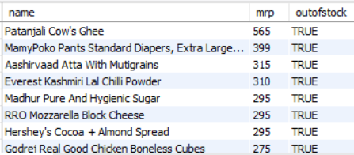
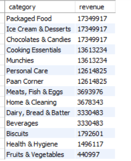
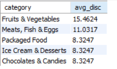
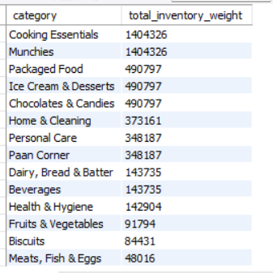
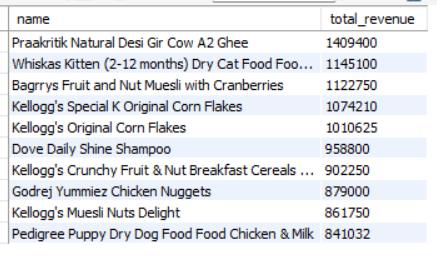
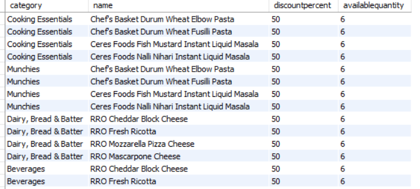
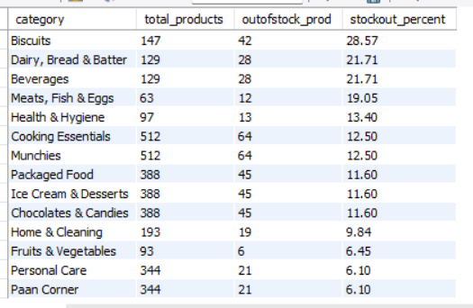

# Zepto Inventory & Sales Analysis using SQL

## Project Overview

This project focuses on analyzing Zepto's product inventory and pricing data using SQL to uncover meaningful business insights related to:

- Product availability
- Inventory management
- Revenue contribution
- Pricing strategy
- Category performance

The objective of this project is to transform raw product-level data into actionable insights that can support business decisions around inventory planning, pricing optimization, and revenue growth.

---

## Business Problem

Quick-commerce businesses like Zepto need to efficiently manage thousands of products while maintaining:

- High product availability
- Optimized inventory levels
- Competitive pricing
- Maximum revenue generation

This analysis aims to answer important business questions such as:

- Which products are unavailable despite having high value?
- Which categories contribute most to revenue?
- Which categories have high inventory but low revenue contribution?
- Where are stock availability issues occurring?
- Which products have pricing opportunities?

---

## Dataset Information

The dataset contains product-level information including:

| Column | Description |
|---|---|
| Category | Product category |
| Name | Product name |
| MRP | Maximum retail price |
| DiscountPercent | Discount percentage offered |
| DiscountedSellingPrice | Final selling price |
| AvailableQuantity | Current inventory quantity |
| OutOfStock | Product availability status |
| WeightInGms | Product weight |
| Quantity | Product quantity |

---

## Tools & Technologies Used

- MySQL
- SQL
- GitHub
- Data Cleaning
- Exploratory Data Analysis

---

## Project Workflow

## 1. Data Exploration

Performed initial exploration to understand:

- Dataset size
- Column structure
- Data types
- Sample records

Queries performed:

- COUNT()
- DESCRIBE
- SELECT

---

## 2. Data Cleaning

### Handling Missing Values

Checked for missing values across important columns:

- Category
- Product name
- MRP
- Discount
- Quantity
- Availability

### Removing Invalid Records

Identified and removed products where:

- MRP = 0
- Selling Price = 0

### Currency Conversion

Converted price values from paise to rupees for better analysis.

---

## 3. SQL Analysis & Business Questions

### 1. What are the products with high mrp but out of stock

Insight: There are high value products which contribute higher value per unit but due to being out of stock they are leading to potential revenue loss

Recommendation: The inventory team must monitor availability of these premium products and prioritize restocking so they can prevent this revenue loss due to unavailability of products.

### 2. Calculate estimated revenue for each category

Insight: Categories like Packaged Food, Ice Cream & Desserts, Chocolates & Candies, Cooking Essentials are generating higher revenue across the categories

Recommendation: Company has to look after maintaining their availability and also optimise their inventory so they consistently contribute to revenue growth.

### 3. Identify the top 5 categories offering the highest average discount percentage

Insight: Categories like Fruits & Vegetables and Meats, Fish & Eggs are running on higher discounts than other other categories, therefore operating on aggressive pricing strategies

Recommendation: These categories which are using higher discounts than average their profit margins must be monitored and balanced to ensure that though discount brings sales they must not negatively impact our profit margins.

### 4. What is the total inventory weight per category

Insight: Categories like Cooking Essentials, Munchies are the categories with higher inventory weight representing greater storage allocation

Recommendation: The team must do effective inventory planning to avoid overstocking and also run operations which improve storage efficiency.

### 5. Find the top 10 products contributing the most to total revenue.

Insights: These are the top 10 products contributing the most to the total revenue which makes them valuable products for the company

Recommendation: These top-performing products can be used as anchor products in marketing campaigns and advertising strategies to increase customer engagement and drive additional sales.

### 6. Find products where discount percentage is high but available quantity is also high.

Insight: These are the products on which higher discounts are been provided still they are maintaining higher availability and inventory

Recommendation: Company should evaluate the situation whether discounts are driving higher sales so is the inventory being maintained properly or though after higher discounts sales are are not taking place which is ultimately leading to availability as the stock is not been going out and unutilised. 

### 7. Which categories are suffering from poor product availability

Insight: Categories like Biscuits (28.57%), Dairy-Bread & Batter(21.71%), Beverages(21.71%) are facing product unavailability with them and having higher out of stock products with them

Recommendation: The company should focus on keeping these categories consistently available by improving stock planning and restocking products on time. This will help reduce product unavailability, avoid losing potential sales, and provide a better customer experience.

