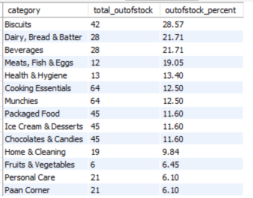

# zepto_analytics

# Zepto Inventory & Sales Analysis using SQL

## Project Overview

This project focuses on analyzing Zepto's product inventory and pricing data using SQL to uncover meaningful business insights related to:

- Product availability
- Inventory management
- Revenue contribution
- Pricing strategy
- Category performance

The objective of this project is to transform raw product-level data into actionable insights that can support business decisions around inventory planning, pricing optimization, and revenue growth.

---

## Business Problem

Quick-commerce businesses like Zepto need to efficiently manage thousands of products while maintaining:

- High product availability
- Optimized inventory levels
- Competitive pricing
- Maximum revenue generation

This analysis aims to answer important business questions such as:

- Which products are unavailable despite having high value?
- Which categories contribute most to revenue?
- Which categories have high inventory but low revenue contribution?
- Where are stock availability issues occurring?
- Which products have pricing opportunities?

---

# Dataset Information

The dataset contains product-level information including:

| Column | Description |
|---|---|
| Category | Product category |
| Name | Product name |
| MRP | Maximum retail price |
| DiscountPercent | Discount percentage offered |
| DiscountedSellingPrice | Final selling price |
| AvailableQuantity | Current inventory quantity |
| OutOfStock | Product availability status |
| WeightInGms | Product weight |
| Quantity | Product quantity |

---

# Tools & Technologies Used

- MySQL
- SQL
- GitHub
- Data Cleaning
- Exploratory Data Analysis

---

# Project Workflow

## 1. Data Exploration

Performed initial exploration to understand:

- Dataset size
- Column structure
- Data types
- Sample records

Queries performed:

- COUNT()
- DESCRIBE
- SELECT

---

# 2. Data Cleaning

### Handling Missing Values

Checked for missing values across important columns:

- Category
- Product name
- MRP
- Discount
- Quantity
- Availability

### Removing Invalid Records

Identified and removed products where:

- MRP = 0
- Selling Price = 0

### Currency Conversion

Converted price values from paise to rupees for better analysis.

---

# 3. SQL Analysis & Business Questions

#1 What are the products with high mrp but out of stock

#2 Calculate estimated revenue for each category

#3 Identify the top 5 categories offering the highest average discount percentage

#4 Find the price per gram for products above 100g and sort by best value

#5 What is the total inventory weight per category

#6 Find the top 10 products contributing the most to total revenue.

#7 Find products where discount percentage is high but available quantity is also high.

#8 Calculate out-of-stock percentage by category.

#9 Which categories are suffering from poor product availability

